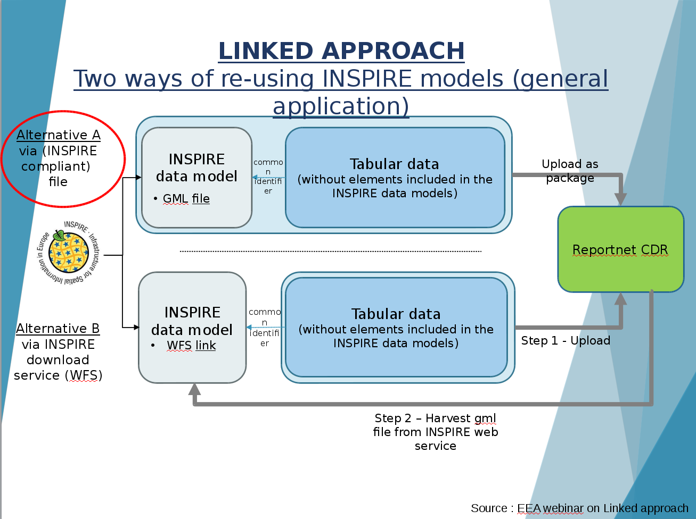
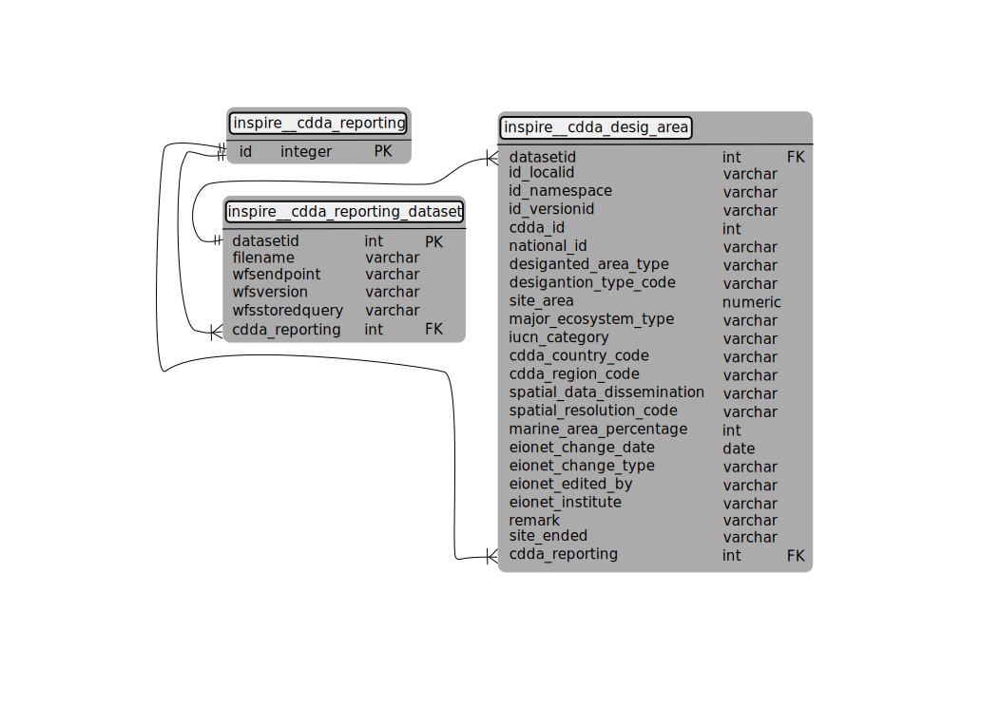

# CDDA eReporting
The 2018 [Common Database on DesignatedAreas (CDDA) eReporting](
https://www.eea.europa.eu/themes/biodiversity/document-library/cdda-2018-reporting)
is planned to use the data that has already been published under the [Inspire
ProtectedSites theme](http://inspire.ec.europa.eu/theme/ps). The European
Environmental Agency (EEA) has decided to use a "linked approach" meaning that
the current CDDA data model is split in two:
- data available through the Inspire ps:ProtectedSite download service (Type1 data)
- data relevant to CDDA reporting objectives (Type2 data)

The following figure from a presentation by Stefania Morrone during the NRC EIS
November 2018 meeting illustrates how the process is envisioned through two
possible alternatives.



> Excerpt from a presentation by Stefania Morrone during the 23.11.2017 NRC EIS
meeting. The full presentation is available for download at [the NRC EIS library](https://forum.eionet.europa.eu/nrc-eis-environmental-information-systems/library/meetings/2017-nrc-eis-meeting/presentations/linked-approach-epsilon-23.11.17)

The first alternative requires a multi-file package to be uploaded to Reportnet
(the software used by the EEA to manage all reporting-related questions). This
multi-file package will consist of 1 or more GML files with spatial data from
an Inspire compliant ps:ProtectedSite dataset (called Type1 data), and one
XML file with all the required reporting-data (called Type2 data). The Type2
dataset will have references to the Type1 dataset on an object basis so
every "row" in the Type2 dataset will have a reference to feature in the Type1
dataset.

The second alternative has the same overall structure with the difference that
no GML data will be provided beforehand - only the Type2 reporting data with
relevant links to Inspire ps:ProtectedSite datasets (1 or many). After uploading
the Type2 package to Reportnet, EEA will harvest the related ps:ProtectedSite
download services and produce the required GML files.

During the 2018 reporting campaign the first alternative will be used.

## How it works
The idea behind this implemention is to use the [GeoServer](http://geoserver.org)
[app-schema plugin](http://docs.geoserver.org/stable/en/user/data/app-schema/index.html)
by utilizing the xsd schemas published by the EEA in their
[Data Dictionary](http://dd.eionet.europa.eu/). Although a web-service oriented
approach is not required at the moment we can still make use of the power the
[app-schema plugin](http://docs.geoserver.org/stable/en/user/data/app-schema/index.html)
offers for schema transformation (since our "linked" ps:ProtectedSite WFS will
be using the same set of tools). We'll let GeoServer handle the schema
transformation for the Type2 CDDA reporting dataset and then we can use a simple
[WFS GetFeature request](#sample-queries-and-output) to query the dataset.

This means that the response we get will not be 100% schema compliant as it will
be served as a `wfs:member` in a `wfs:FeatureCollection`. So we'll need to go
a step further and use [an extra tool](#packaging-of-type1-and-type2) to extract
the required portion of the response (Type2) and pregenerate the ProtectedSite
GML files (Type1) aswell.  


## XSD files
The EEA has published the XML schemas for use in data transformation on their
[Data Dictionary webpage](http://dd.eionet.europa.eu/datasets/3344). These
XSD files will produce a XML document with the following structure:

```
- {http://dd.eionet.europe.eu/namespaces/11}:CDDA
    - {http://dd.eionet.europe.eu/namespaces/873}:DesignatedArea
        - {http://dd.eionet.europe.eu/namespaces/873}:Row
            - {http://dd.eionet.europe.eu/namespaces/873}:cddaId
            - {http://dd.eionet.europe.eu/namespaces/873}:nationalId
            - {http://dd.eionet.europe.eu/namespaces/873}:PSlocalId
            - [...]
        - {http://dd.eionet.europe.eu/namespaces/873}:Row
        - {http://dd.eionet.europe.eu/namespaces/873}:Row
        - [...]
    - {http://dd.eionet.europe.eu/namespaces/874}:LinkedDataset
            - {http://dd.eionet.europe.eu/namespaces/874}:Row
                - {http://dd.eionet.europe.eu/namespaces/874}:datasetId
                - {http://dd.eionet.europe.eu/namespaces/874}:gmlFileName
                - [...]
            - [...]
```

As an example output, let's consider:

```
<?xml version="1.0" encoding="UTF-8"?>
<CDDA
    xmlns="http://dd.eionet.europa.eu/namespaces/11"
    xmlns:xsi="http://www.w3.org/2001/XMLSchema-instance"
    xsi:schemaLocation="http://dd.eionet.europa.eu/namespaces/11  http://dd.eionet.europa.eu/v2/dataset/3344/schema-dst-3344.xsd">
    <DesignatedArea xmlns="http://dd.eionet.europa.eu/namespaces/873">
        <Row>
            <cddaId/>
            <nationalId/>
            <PSlocalId/>
            <PSnamespace/>
            <PSversionId/>
            <designatedAreaType/>
            <cddaCountryCode/>
            <cddaRegionCode/>
            <designationTypeCode/>
            <iucnCategory/>
            <siteArea/>
            <majorEcosystemType/>
            <marineAreaPercentage/>
            <spatialDataDissemination/>
            <spatialResolutionCode/>
            <eionetChangeDate/>
            <eionetChangeType/>
            <eionetEditedBy/>
            <eionetInstitute/>
            <remark/>
            <siteEnded/>
            <containedBy/>
        </Row>
		<Row>
            <cddaId/>
            <nationalId/>
            <PSlocalId/>
            <PSnamespace/>
            <PSversionId/>
            <designatedAreaType/>
            <cddaCountryCode/>
            <cddaRegionCode/>
            <designationTypeCode/>
            <iucnCategory/>
            <siteArea/>
            <majorEcosystemType/>
            <marineAreaPercentage/>
            <spatialDataDissemination/>
            <spatialResolutionCode/>
            <eionetChangeDate/>
            <eionetChangeType/>
            <eionetEditedBy/>
            <eionetInstitute/>
            <remark/>
            <siteEnded/>
            <containedBy/>
        </Row>
    </DesignatedArea>
    <LinkedDataset xmlns="http://dd.eionet.europa.eu/namespaces/874">
        <Row>
            <datasetId/>
            <gmlFileName/>
            <wfsEndpoint/>
            <wfsVersion/>
            <wfsStoredQuery/>
        </Row>
        <Row>
            <datasetId/>
            <gmlFileName/>
            <wfsEndpoint/>
            <wfsVersion/>
            <wfsStoredQuery/>
        </Row>		
    </LinkedDataset>
</CDDA>
```
> Example Type2 dataset structure provided by the EEA.

The latter example has two (empty) instances (rows) for both: DesignatedArea
and LinkedDataset.

In order for the xsd files to be used with GeoServer app-schema a slight
adjustment is needed in both the DesignatedArea and LinkedDataset schema files:
both the DesignatedArea/Row and LinkedDataset/Row types need to be made
available at the respective schema root level. Otherwise the mapping seems to
fail with a "no top element found" exception. For a further discussion on the
subject refer to documentation on GeoServer app-schemas and the
[GML "striping" rules](http://docs.geoserver.org/stable/en/user/data/app-schema/mapping-file.html#targetattributenode-optional).

The difference between the original XSD (downloaded from the EEA Data Dictionary
on 23.11.2017) and the modified one can be seen in the commit history of this
repo:
- [schema-tbl-11022.xsd](https://github.com/e-gov/kem-inspire/commit/8aba6c021cd36833e61d44ae769b2ab770a7e277?diff=split#diff-1a14292e57abfb7ca97cf2e53671b9d6)
- [schema-tbl-11023.xsd](https://github.com/e-gov/kem-inspire/commit/8aba6c021cd36833e61d44ae769b2ab770a7e277?diff=split#diff-56c568136b9c1de58815257b357c03e2)

The third xsd [schema-dst-3344.xsd](https://github.com/e-gov/kem-inspire/commit/8aba6c021cd36833e61d44ae769b2ab770a7e277?diff=split#diff-bbe09d95908dc2be5109a30a79daec76)
does not require any changes.


## Input data model
The input relational data model is sketched on the following figure



We are going to be mapping three elements `dd11:CDDA` (from the table
`inspire__cdda_reporting`) and it's immediate children `dd873:DesignatedArea`
(from `inspire__cdda_desig_area`) and `dd874:LinkedDataset`
(from `inspire__cdda_reporting_dataset`). The XML namespace notation is the
same as the previous [samples](#xsd-files) are using.

Sample DDL SQL file is available [here](sample.sql).

The `inspire__cdda_reporting` table should have as many rows
as many `dd11:CDDA` elements are needed which should amount to 1. This is the
element that shall be encoded within a single `wfs:FeatureCollection/wfs:member`.

Because the multiplicity of both `dd874:LinkedDataset` and `dd873:DesignatedArea`
within `dd11:CDDA` is defined as `maxOccurs="1" minOccurs="1"` these will be
encoded as single elements. If you'd think of `dd11:CDDA` as a DBMS schema then
the LinkedDataset and DesignatedArea elements could be thought of as DB
tables, each with a 0 to "unbounded" number of rows.

The `inspire__cdda_reporting_dataset` holds the data for the
`dd874:LinkedDataset` element. It's relation to `inspire__cdda_reporting` is
defined through

```
inspire__cdda_reporting.id = inspire__cdda_reporting_dataset.cdda_reporting
```

Every row in the `inspire__cdda_reporting_dataset` will represent one Type1
GML file / WFS service query and each row maps to `dd874:Row`.

The `ìnspire__cdda_desig_area` table holds the data for the
`dd873:DesignatedArea` element. It's relation to specific Type1 dataset is
defined through

```
inspire__cdda_desig_area.datasetid = inspire__cdda_reporting_dataset.datasetid
```

and to `dd11:CDDA` through

```
inspire__cdda_desig_area.cdda_reporting = inspire__cdda_reporting.id
```

Every row in the `inspire__cdda_desig_area` will represent one designated area
that's reported upon and each row here maps to `dd873:Row`.


## Sample queries and output
As stated before the main idea of this work is to make use of a known API for
querying CDDA Type2 data and the OGC WebFeatureService (WFS) is one possibility
here. So using the `GetFeature` request we can do

```
$ http "http://localhost:8080/geoserver/dd11/ows?service=WFS&version=2.0.0&request=GetFeature&typeName=dd11:CDDA"
```

which will yield response HTTP headers

```
HTTP/1.1 200 OK
Content-Disposition: inline; filename=geoserver-GetFeature.text
Content-Encoding: gzip
Content-Type: text/xml; subtype=gml/3.2
Server: Jetty(9.2.13.v20150730)
Transfer-Encoding: chunked
```

and based on sample dataset from the
[Estonian Environment Agency](http://keskkonnaagentuur.ee/en) will return
a HTTP response like (identiation added by hand for readability)

```
<?xml version="1.0" encoding="UTF-8"?>
<wfs:FeatureCollection
    xmlns:wfs="http://www.opengis.net/wfs/2.0"
    xmlns:xs="http://www.w3.org/2001/XMLSchema"
    xmlns:isoattrs="http://dd.eionet.europa.eu/namespaces/2"
    xmlns:ddattrs="http://dd.eionet.europa.eu/namespaces/3"
    xmlns:hfp="http://www.w3.org/2001/XMLSchema-hasFacetAndProperty"
    xmlns:gml="http://www.opengis.net/gml/3.2"
    xmlns:dd874="http://dd.eionet.europa.eu/namespaces/874"
    xmlns:dd873="http://dd.eionet.europa.eu/namespaces/873"
    xmlns:datasets="http://dd.eionet.europa.eu/namespaces/1"
    xmlns:dd11="http://dd.eionet.europa.eu/namespaces/11"
    xmlns:xsi="http://www.w3.org/2001/XMLSchema-instance"
    numberMatched="unknown" numberReturned="1" timeStamp="2017-12-18T08:13:22.528Z"
    xsi:schemaLocation="http://www.opengis.net/wfs/2.0
    http://localhost:8080/geoserver/schemas/wfs/2.0/wfs.xsd
    http://dd.eionet.europa.eu/namespaces/11
    http://dd.eionet.europa.eu/namespaces/11/schema-dst-3344.xsd
    http://www.opengis.net/gml/3.2 http://localhost:8080/geoserver/schemas/gml/3.2.1/gml.xsd">
    <wfs:member>
        <dd11:CDDA gml:id="1">
            <dd873:DesignatedArea>
                <dd873:Row>
                    <dd873:cddaId>180617</dd873:cddaId>
                    <dd873:nationalId>1731</dd873:nationalId>
                    <dd873:PSlocalId>1731</dd873:PSlocalId>
                    <dd873:PSnamespace>http://registry.envir.ee/datasets/eelis/ala</dd873:PSnamespace>
                    <dd873:PSversionId>20140213090427</dd873:PSversionId>
                    <dd873:designatedAreaType>designatedSite</dd873:designatedAreaType>
                    <dd873:cddaCountryCode>EE</dd873:cddaCountryCode>
                    <dd873:cddaRegionCode>EE</dd873:cddaRegionCode>
                    <dd873:designationTypeCode>EE13</dd873:designationTypeCode>
                    <dd873:iucnCategory>V</dd873:iucnCategory>
                    <dd873:siteArea>8.8</dd873:siteArea>
                    <dd873:majorEcosystemType>marineAndTerrestrial</dd873:majorEcosystemType>
                    <dd873:spatialDataDissemination>public</dd873:spatialDataDissemination>
                    <dd873:spatialResolutionCode>scaleLarger100K</dd873:spatialResolutionCode>
                    <dd873:eionetChangeDate>2017-12-13 12:57:42Z</dd873:eionetChangeDate>
                    <dd873:eionetChangeType>U</dd873:eionetChangeType>
                    <dd873:eionetEditedBy>editor-name</dd873:eionetEditedBy>
                    <dd873:eionetInstitute>eionet-institute-name</dd873:eionetInstitute>
                    <dd873:siteEnded>0</dd873:siteEnded>
                    <dd873:containedBy>999</dd873:containedBy>
                </dd873:Row>
                <dd873:Row>
                    <dd873:cddaId>171902</dd873:cddaId>
                    <dd873:nationalId>111</dd873:nationalId>
                    <dd873:PSlocalId>111</dd873:PSlocalId>
                    <dd873:PSnamespace>http://registry.envir.ee/datasets/eelis/ala</dd873:PSnamespace>
                    <dd873:PSversionId>20140313143829</dd873:PSversionId>
                    <dd873:designatedAreaType>designatedSite</dd873:designatedAreaType>
                    <dd873:cddaCountryCode>EE</dd873:cddaCountryCode>
                    <dd873:cddaRegionCode>EE</dd873:cddaRegionCode>
                    <dd873:designationTypeCode>EE18</dd873:designationTypeCode>
                    <dd873:iucnCategory>III</dd873:iucnCategory>
                    <dd873:siteArea>0.0</dd873:siteArea>
                    <dd873:majorEcosystemType>terrestrial</dd873:majorEcosystemType>
                    <dd873:spatialDataDissemination>public</dd873:spatialDataDissemination>
                    <dd873:spatialResolutionCode>scaleLarger100K</dd873:spatialResolutionCode>
                    <dd873:eionetChangeDate>2017-12-13 12:57:42Z</dd873:eionetChangeDate>
                    <dd873:eionetChangeType>U</dd873:eionetChangeType>
                    <dd873:eionetEditedBy>editor-name</dd873:eionetEditedBy>
                    <dd873:eionetInstitute>eionet-institute-name</dd873:eionetInstitute>
                    <dd873:siteEnded>0</dd873:siteEnded>
                    <dd873:containedBy>999</dd873:containedBy>
                </dd873:Row>
                <dd873:Row>
                    <dd873:cddaId>392351</dd873:cddaId>
                    <dd873:nationalId>1974541864</dd873:nationalId>
                    <dd873:PSlocalId>1974541864</dd873:PSlocalId>
                    <dd873:PSnamespace>http://registry.envir.ee/datasets/eelis/ala</dd873:PSnamespace>
                    <dd873:PSversionId>20140306105812</dd873:PSversionId>
                    <dd873:designatedAreaType>designatedSite</dd873:designatedAreaType>
                    <dd873:cddaCountryCode>EE</dd873:cddaCountryCode>
                    <dd873:cddaRegionCode>EE</dd873:cddaRegionCode>
                    <dd873:designationTypeCode>EE03</dd873:designationTypeCode>
                    <dd873:iucnCategory>IV</dd873:iucnCategory>
                    <dd873:siteArea>29.5</dd873:siteArea>
                    <dd873:majorEcosystemType>marineAndTerrestrial</dd873:majorEcosystemType>
                    <dd873:spatialDataDissemination>public</dd873:spatialDataDissemination>
                    <dd873:spatialResolutionCode>scaleLarger100K</dd873:spatialResolutionCode>
                    <dd873:eionetChangeDate>2017-12-13 12:57:42Z</dd873:eionetChangeDate>
                    <dd873:eionetChangeType>U</dd873:eionetChangeType>
                    <dd873:eionetEditedBy>editor-name</dd873:eionetEditedBy>
                    <dd873:eionetInstitute>eionet-institute-name</dd873:eionetInstitute>
                    <dd873:siteEnded>0</dd873:siteEnded>
                    <dd873:containedBy>1000</dd873:containedBy>
                </dd873:Row>            
            </dd873:DesignatedArea>
            <dd874:LinkedDataset>
                <dd874:Row>
                    <dd874:datasetId>999</dd874:datasetId>
                    <dd874:gmlFileName>nn.gml</dd874:gmlFileName>
                    <dd874:wfsEndpoint>http://n.io/ows?</dd874:wfsEndpoint>
                    <dd874:wfsVersion>2.0.0</dd874:wfsVersion>
                    <dd874:wfsStoredQuery>http://n.io/ops/getspatialdataset</dd874:wfsStoredQuery>
                </dd874:Row>
                <dd874:Row>
                    <dd874:datasetId>1000</dd874:datasetId>
                    <dd874:gmlFileName>mm.gml</dd874:gmlFileName>
                    <dd874:wfsEndpoint>http://n.io/ows?</dd874:wfsEndpoint>
                    <dd874:wfsVersion>2.0.0</dd874:wfsVersion>
                    <dd874:wfsStoredQuery>http://n.io/ops/getsomethingelse</dd874:wfsStoredQuery>
                </dd874:Row>
            </dd874:LinkedDataset>
        </dd11:CDDA>
    </wfs:member>
</wfs:FeatureCollection>
```

This request is based on a sample dataset available from [here](sample.sql)


## Packaging of Type1 and Type2
@TODO


## Setup for reporting
@TODO: + we should create a separate, easy copy-paste filepackage for settng
this workflow up.
